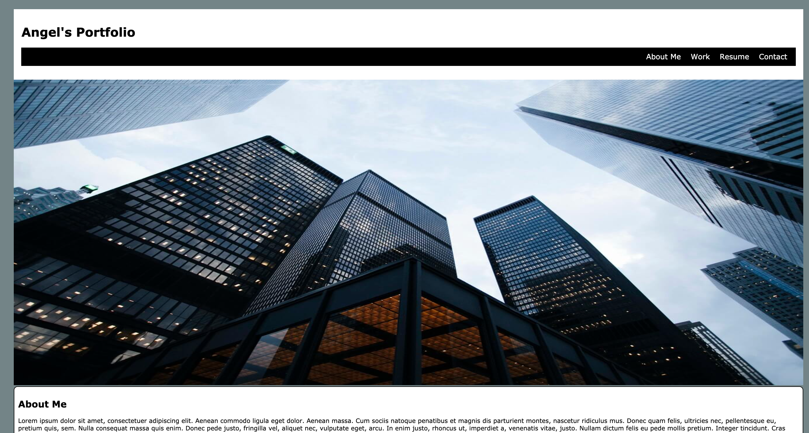

# hw2-portfolio

## Description

- This webpage was created as a start to my personal portfolio.
- This portfolio will be used to showcase my applications to clients and hiring managers. 
- This webpage project helped me better my CSS skills.

## Page Guide
- Nav Bar: Click on Links and it will take user to correct section on page.
- About Me: Holds information about my educational background.
- Work: Holds images that when hovered over by mouse they grow larger.
- Resume: Holds clickable image to my linkedIn.
- Contact: Holds contact info with clickable link to GitHub.
- Footer: Holds link to take you back to the top of the page.

## Link 
https://angelfloreschicago.github.io/hw2-portfolio/

