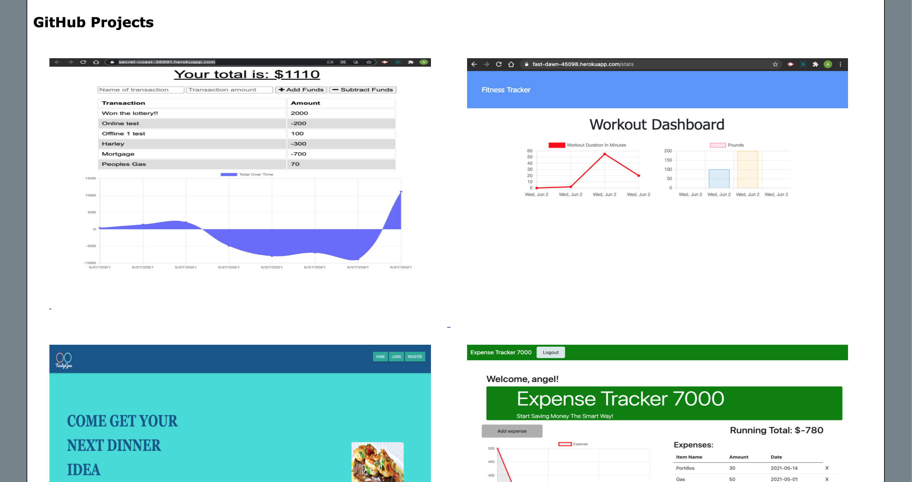

# Angel's Portfolio

## Description
    This is my personal portfilio app. This is where I will showcase my most 
    recent projects. As I continue to learn more about Web Development my goal
    is to continuously update this application. Please visit often. 

## Page Guide
    - Nav Bar: Click on Links and it will take user to correct section on page.
    - About Me: Holds information about my educational background.
    - Work: Holds images that when hovered over by mouse they grow larger.
    - Resume: Holds clickable image to my linkedIn.
    - Contact: Holds contact info with clickable link to GitHub.
    - Footer: Holds link to take you back to the top of the page.

## Deployment
[Angel's Portfolio ](https://angelfloreschicago.github.io/AngelPortfolio/)
This app is deployed on GitHub! (Click Link!)

## Demo

## Recent Updates
    6/6/2021
    Updated portfolio with my most recent projects.
    New projects that use React, local storage, indexedDB etc. 
    5/16/2021:
    Updated portfolio with my most recent projects.
    Now the visitor can see 6 recent projects instead of just 4.
    Replaced ipsum text with a more personalized introduction about myself.
    Thanks!
    4/16/2021: 
    Updated portfolio with recent projects and added new clckable images. 
    Added link to personal resume and changed font color of links. 
    Added alt description to images. 
    Added an image of myself in the about me section.
